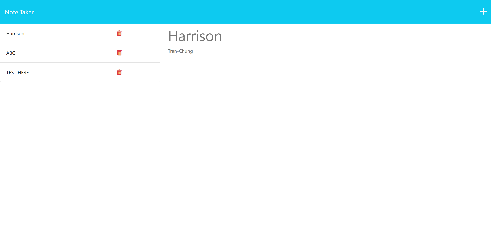

# 11 Express.js: Note Taker

 

## Description

- A full stack note taking application using Express.js
- uses GET and POST Methods 
- Express.js routing 

## Usage

As a user I want to be able to write and save my notes. Using this full stack application I enter values and press the save button. I want to be able to see my notes on the screen. 

## Credits
N/A
